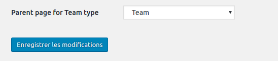

# cpt-parent

A WordPress plugin to allows setting a *page* as parent of a custom post type (CPT).
When doing so, the archive and single pages of the CPT appear to be under the selected
page in the contents hierarchy (by means of URL and breadcrumbs).

**Disclaimer:** I’m publishing this here because it might be useful to others,
but USE OF THIS SCRIPT IS ENTIRELY AT YOUR OWN RISK. I accept no liability from its use.  
That said, I’m using this plugin for several clients and I’m interested in any feature
or security improvement. So please contact me for this kind of requests.

## Installation

You can drop the plugin folder in your `wp-content/plugins` or `wp-content/mu-plugins` directory.  
I recommend using `wp-content/mu-plugins` because that plugin is related to the content structure, so
it shouldn’t be managed by site admin like features (`plugins`) or appearance (`themes`).

If you use the `mu-plugins` directory, don’t forget to require it from an upper-level file
like `/wp-content/mu-plugins/index.php`:

```php
require_once __DIR__ .'/cpt-parent/cpt-parent.php';
```

## Usage

### Enable

You need to add a *filter* to enable the feature for your CPT. For example to enable the
parent page feature for a `team` CPT, you’ll add (in another `mu-plugin`):

```php
add_filter('cpt_has_parent_page', function ($has_parent, $post_type) {
    return $post_type === 'team' ? true : $has_parent;
}, 10, 2);
```

To enable the feature for several CPT at a time (here `team` and `product`):

```php
add_filter('cpt_has_parent_page', function ($has_parent, $post_type) {
    return array_search($post_type, ['team', 'product']) !== false ? true : $has_parent;
}, 10, 2);
```

When done, a corresponding field appear in the WordPress administration,
at the bottom of the *Settings / Reading* screen.



### Template usage

For a `team` CPT, you can use your `archive-team.php` template as usual. In this template,
two actions allow to switch the main WordPress loop to the page and back to the post list:

```php
// switch WordPress main loop to page
do_action('cpt_parent_page_context');

// output the parent page title
the_title();

// reset WordPress main loop to post list
do_action('cpt_parent_reset_context');
```

## Breadcrumbs

When [Yoast SEO](https://github.com/Yoast/wordpress-seo) is available
the breadcrumbs is changed to reflect the modified hierarchy.

## Localization

This plugin can be localized by putting translations in `wp-content/languages/`, for example
`wp-content/languages/cpt-parent-fr_FR.po`.

## Support

I’m interested in any feedback.

## Author

Jérôme Mulsant [https://rue-de-la-vieille.fr](https://rue-de-la-vieille.fr)